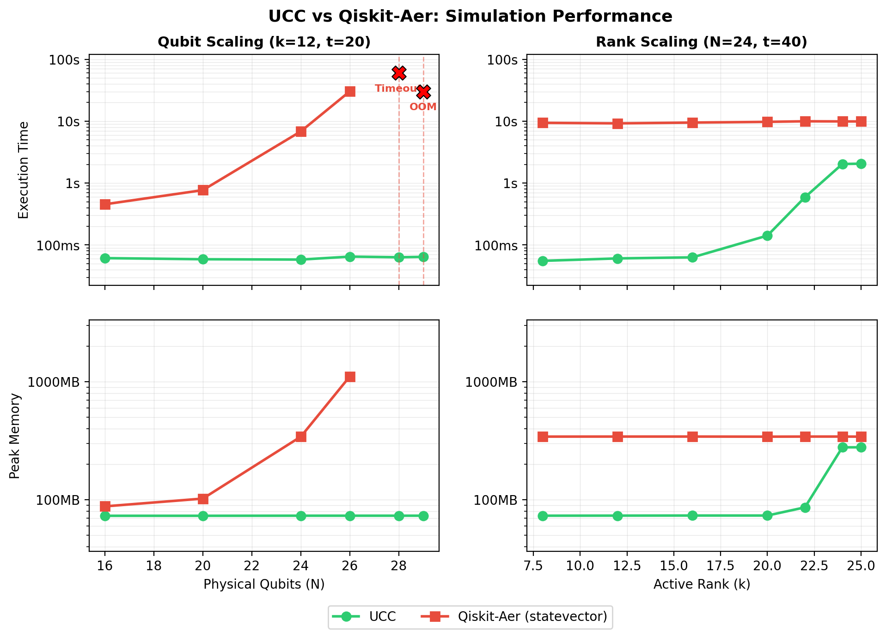

<!--pytest-codeblocks:skipfile-->

# Benchmark: Clifft vs Qiskit-Aer

Clifft's factored-state architecture means simulation cost scales with the circuit's non-Clifford complexity (the *active dimension* $k$, also called the *active rank*), not the total qubit count $N$. This page compares Clifft against Qiskit-Aer's statevector simulator on two parameter sweeps that isolate each scaling axis.



## Circuit Design

The benchmark circuit has three parameters:

- **N** — total physical qubits
- **k** — active dimension (number of qubits that receive non-Clifford T-gates)
- **t** — total T-gates applied

The circuit places T-gates interleaved with Hadamard and CNOT gates on the first $k$ qubits, then pads the remaining $N - k$ qubits with a Clifford entangling layer (Hadamards followed by a CNOT chain across all $N$ qubits).

A dense statevector simulator like Qiskit-Aer must allocate $2^N$ complex amplitudes regardless of circuit structure. Clifft's compiler recognizes that the Clifford padding can be absorbed into an offline Clifford frame $U_C$, so its virtual machine only allocates $2^k$ amplitudes.

## Two Sweeps

### Qubit Scaling (left panels)

Fix $k = 12$ and $t = 20$, sweep $N$ from 16 to 29.

- **Clifft** stays flat at ~60ms and ~73MB regardless of $N$, because its active array is always $2^{12}$.
- **Qiskit-Aer** doubles in time and memory with each additional qubit. It times out at $N = 28$ (>120s) and exceeds available RAM at $N = 29$.

### Active-Dimension Scaling (right panels)

Fix $N = 24$ and $t = 40$, sweep $k$ from 8 to 25.

- **Qiskit-Aer** is constant at ~10s and ~343MB, since it always tracks $2^{24}$ amplitudes.
- **Clifft** scales as $O(2^k)$. For small $k$ it is over 100x faster; by $k = 24$ the two converge because Clifft's active array approaches Qiskit's full statevector.

This is the honest tradeoff: Clifft wins when $k \ll N$, which is the regime relevant to most error-corrected and near-term circuits where Clifford gates dominate.

## Prerequisites

```bash
pip install clifft qiskit qiskit-aer matplotlib
```

## Running the Benchmark

The benchmark script is self-contained. It generates circuits in Qiskit, converts them to Stim format for Clifft, runs both simulators in isolated subprocesses (for clean memory measurement), and produces the plot.

```bash
# Run full benchmark and generate plot
python docs/guide/scripts/run_benchmark.py

# Re-plot from existing results without re-running
python docs/guide/scripts/run_benchmark.py --plot-only

# Custom output path
python docs/guide/scripts/run_benchmark.py -o my_plot.png
```

On an 8GB machine, the full sweep takes approximately 5-10 minutes. Qiskit will naturally time out or OOM on the larger qubit counts.

## Key Excerpts

The core logic is shown below. See [`docs/guide/scripts/run_benchmark.py`](https://github.com/unitaryfoundation/clifft/blob/main/docs/guide/scripts/run_benchmark.py) for the complete runnable script including plotting, subprocess isolation, and CSV output.

```python
import os
import re
import sys
import time
from typing import Any


# ---------------------------------------------------------------------------
# Circuit generation (Qiskit) and QASM-to-Stim conversion
# ---------------------------------------------------------------------------


def build_circuit_qiskit(n: int, t: int, k: int) -> str:
    """Build a benchmark circuit in Qiskit, return QASM 2.0 string.

    The circuit places T-gates (non-Clifford) on k active qubits and
    pads the remaining N-k qubits with Cliffords.  A dense-state
    simulator must track 2^N amplitudes, but Clifft's factored-state
    representation only needs 2^k.
    """
    from qiskit import QuantumCircuit
    from qiskit.qasm2 import dumps

    actual_k = min(k, n)
    qc = QuantumCircuit(n, n)

    # Superposition on the active core
    for i in range(actual_k):
        qc.h(i)

    # T-gates interleaved with Cliffords on the active core
    for i in range(t):
        tgt = i % actual_k
        qc.t(tgt)
        qc.h(tgt)
        if actual_k > 1:
            nxt = (tgt + 1) % actual_k
            qc.cx(tgt, nxt)

    # Clifford padding on spectator qubits
    for i in range(actual_k, n):
        qc.h(i)
    for i in range(n - 1):
        qc.cx(i, i + 1)

    # Measure all
    qc.measure(range(n), range(n))
    return dumps(qc)


def qasm_to_stim(qasm: str) -> str:
    """Convert an OpenQASM 2.0 string to Stim circuit format.

    Handles the small gate set used by our benchmark circuits:
    h, t, cx, and measure.
    """
    lines: list[str] = []
    for raw in qasm.splitlines():
        line = raw.strip().rstrip(";")
        if not line or line.startswith(
            ("OPENQASM", "include", "qreg", "creg", "//")
        ):
            continue

        m = re.match(r"^h\s+q\[(\d+)\]$", line)
        if m:
            lines.append(f"H {m.group(1)}")
            continue

        m = re.match(r"^t\s+q\[(\d+)\]$", line)
        if m:
            lines.append(f"T {m.group(1)}")
            continue

        m = re.match(r"^cx\s+q\[(\d+)\]\s*,\s*q\[(\d+)\]$", line)
        if m:
            lines.append(f"CX {m.group(1)} {m.group(2)}")
            continue

        m = re.match(r"^measure\s+q\[(\d+)\]\s*->\s*c\[(\d+)\]$", line)
        if m:
            lines.append(f"M {m.group(1)}")
            continue

    return "\n".join(lines) + "\n"


# ---------------------------------------------------------------------------
# Subprocess isolation for clean timing / memory measurement
# ---------------------------------------------------------------------------


def run_worker(tool: str, qasm_str: str, stim_str: str) -> dict[str, Any]:
    """Run a single simulation in an isolated subprocess."""
    import tempfile

    with tempfile.NamedTemporaryFile(
        mode="w", suffix=".qasm", delete=False
    ) as qf, tempfile.NamedTemporaryFile(
        mode="w", suffix=".stim", delete=False
    ) as sf:
        qf.write(qasm_str)
        sf.write(stim_str)
        qasm_path, stim_path = qf.name, sf.name

    try:
        cmd = [sys.executable, __file__,
               "--internal-worker", tool, qasm_path, stim_path]
        env = os.environ.copy()
        env["OMP_NUM_THREADS"] = "1"
        env["MKL_NUM_THREADS"] = "1"
        env["CLIFFT_BENCH_MEM_LIMIT_GB"] = str(MEM_LIMIT_GB)

        result = subprocess.run(
            cmd, capture_output=True, text=True,
            timeout=TIMEOUT_S, env=env,
        )

        if result.returncode in (-9, 137) or any(
            s in result.stderr
            for s in ("MemoryError", "bad_alloc")
        ):
            return {"status": "OOM", "exec_s": 0.0, "peak_mb": 0.0}
        if result.returncode != 0:
            return {"status": "ERROR", "exec_s": 0.0, "peak_mb": 0.0}

        return json.loads(result.stdout.strip().split("\n")[-1])

    except subprocess.TimeoutExpired:
        return {"status": "TIMEOUT", "exec_s": float(TIMEOUT_S),
                "peak_mb": 0.0}
    finally:
        os.unlink(qasm_path)
        os.unlink(stim_path)


def execute_internal(tool: str, qasm_path: str, stim_path: str) -> None:
    """Payload executed inside the isolated subprocess."""
    if sys.platform.startswith("linux"):
        mem_str = os.environ.get("CLIFFT_BENCH_MEM_LIMIT_GB")
        if mem_str:
            limit = int(float(mem_str) * 1024**3)
            resource.setrlimit(
                resource.RLIMIT_AS, (limit, limit)
            )

    start = time.perf_counter()

    if tool == "qiskit":
        from qiskit import QuantumCircuit, transpile
        from qiskit_aer import AerSimulator

        qc = QuantumCircuit.from_qasm_file(qasm_path)
        sim = AerSimulator(
            method="statevector", max_parallel_threads=1
        )
        sim.run(transpile(qc, sim), shots=1).result()

    elif tool == "clifft":
        import clifft

        with open(stim_path) as f:
            program = clifft.compile(f.read())
        clifft.sample(program, shots=1)

    elapsed = time.perf_counter() - start
    peak_kb = resource.getrusage(resource.RUSAGE_SELF).ru_maxrss
    peak_mb = peak_kb / 1024

    print(json.dumps({
        "status": "SUCCESS", "exec_s": elapsed, "peak_mb": peak_mb
    }))
    sys.exit(0)


# ---------------------------------------------------------------------------
# Sweep orchestration
# ---------------------------------------------------------------------------


def run_sweeps() -> list[list[Any]]:
    """Run both parameter sweeps and return result rows."""
    rows: list[list[Any]] = []

    # Sweep A: qubit scaling (fix k=12, t=20, vary N)
    for n in [16, 20, 24, 26, 28, 29]:
        for tool in ["clifft", "qiskit"]:
            qasm = build_circuit_qiskit(n, 20, 12)
            stim = qasm_to_stim(qasm)
            res = run_worker(tool, qasm, stim)
            rows.append([
                "qubit_scaling", n, 20, 12, tool,
                res["status"], res["exec_s"], res["peak_mb"],
            ])

    # Sweep B: rank scaling (fix N=24, t=40, vary k)
    for k in [8, 12, 16, 20, 22, 24, 25]:
        for tool in ["clifft", "qiskit"]:
            qasm = build_circuit_qiskit(24, 40, k)
            stim = qasm_to_stim(qasm)
            res = run_worker(tool, qasm, stim)
            rows.append([
                "rank_scaling", 24, 40, k, tool,
                res["status"], res["exec_s"], res["peak_mb"],
            ])

    return rows
```

## How It Works

### Circuit Generation

Circuits are built in Qiskit (`QuantumCircuit`), then exported to OpenQASM 2.0. A lightweight `qasm_to_stim()` function converts the QASM to Stim format using simple string rewriting — no external conversion tools needed.

The conversion handles four gate types:

| QASM | Stim |
|------|------|
| `h q[i];` | `H i` |
| `t q[i];` | `T i` |
| `cx q[i],q[j];` | `CX i j` |
| `measure q[i] -> c[i];` | `M i` |

### Subprocess Isolation

Each simulation runs in a separate subprocess with:

- **Memory limit** via `RLIMIT_AS` (6.5GB default) to catch OOM cleanly
- **Timeout** of 120 seconds
- **Single-threaded** execution (`OMP_NUM_THREADS=1`) for fair comparison
- **Peak memory** measured via `resource.getrusage(RUSAGE_SELF).ru_maxrss`

### Why Clifft Wins at Low Active Dimension

The key insight is Clifft's factored-state representation:

$$|\psi\rangle = \gamma \, U_C \, P \, (|\phi\rangle_A \otimes |0\rangle_D)$$

The compiler absorbs all Clifford gates into the offline Clifford frame $U_C$. Only the active subspace $|\phi\rangle_A$ (dimension $2^k$) is stored and evolved by the virtual machine. At runtime the VM maintains only the active statevector and a lightweight Pauli frame $P$ (updated by XOR for conditional Paulis and noise); $U_C$ is not tracked online. The dormant qubits $|0\rangle_D$ cost nothing at runtime.

Qiskit-Aer has no such factorization — it must allocate and evolve a full $2^N$ statevector for every circuit.

!!! note "Reproducing results"
    Exact timings depend on hardware. The qualitative scaling behavior (Clifft flat in N, exponential in k; Qiskit exponential in N, flat in k) is consistent across machines. The pre-generated plot was produced on a single-core Linux VM with 8GB RAM.
