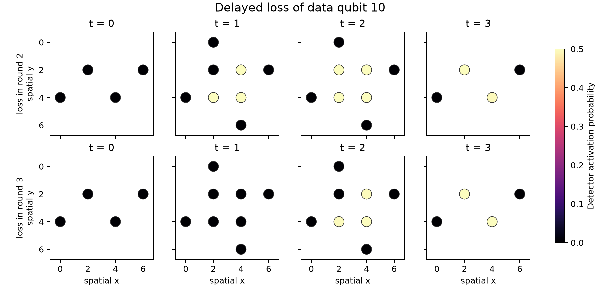

<!--pytest-codeblocks:skipfile-->

# Tutorial: Delayed Loss in a Surface Code

!!! warning "Experimental"
    `clifft.noncomp` is new and actively evolving. Try it and share feedback,
    but expect its API and supported models to change as use cases develop.

This tutorial recreates the idea behind Figure 8 of Baranes *et al.*,
["Leveraging Qubit Loss Detection in Fault Tolerant Quantum
Algorithms"](https://arxiv.org/abs/2502.20558). We lose the same data qubit at
two different times in a distance-3 surface-code memory experiment. Both
losses are detected at the same final measurement, but they produce different
detector patterns because they cancel different sets of later gates.

The example uses the paper's gate-cancellation model: after a site is lost,
an operation touching it acts trivially. State-selective readout distinguishes
0, 1, and loss. These are the semantics of Clifft's `lost` level, operation
dropping, and three-symbol measurement classifier.

This is a simulation tutorial, not a reproduction of the paper's
delayed-erasure decoder or logical-error-rate results.

## Prerequisites

The circuit is generated with Stim and the detector plot uses Matplotlib:

```bash
pip install clifft stim matplotlib
```

## Generate the memory experiment

Start with a noiseless rotated surface-code memory-Z circuit. Flattening the
`REPEAT` block makes it possible to place a loss at a particular round.

```python
import matplotlib.pyplot as plt
import numpy as np
import stim

from clifft import noncomp

distance = 3
rounds = 3
data_qubit = 10

base = stim.Circuit.generated(
    "surface_code:rotated_memory_z",
    distance=distance,
    rounds=rounds,
).flattened()

print(base.get_final_qubit_coordinates()[data_qubit])
```

Output:

```text
[3.0, 3.0]
```

Qubit 10 is the central data site. It participates in four `CX` interactions
per syndrome-extraction round and is not measured until the final data readout.
With three extraction rounds, Stim reports four detector slices, numbered 0
through 3: an initial syndrome, two later syndrome comparisons, and the final
data readout. These correspond to the four stages in the paper's example, with
Stim's time coordinate starting at zero.

## Select two possible loss times

The helper below inserts certain loss after that site's first `CX` interaction
in a one-based round. The rest of the generated circuit is unchanged.

```python
def force_loss_after_first_interaction(
    circuit: stim.Circuit,
    *,
    round_number: int,
) -> str:
    interactions_per_round = 4
    wanted_interaction = interactions_per_round * (round_number - 1) + 1
    seen_interactions = 0
    inserted = False
    lines = []

    for line in str(circuit).splitlines():
        lines.append(line)
        words = line.split()
        if words and words[0] == "CX" and str(data_qubit) in words[1:]:
            seen_interactions += 1
            if seen_interactions == wanted_interaction:
                lines.append(f"LOSS(1) {data_qubit}")
                inserted = True

    if not inserted:
        raise ValueError(f"round {round_number} is outside the generated circuit")
    return "\n".join(lines)


loss_in_round_2 = force_loss_after_first_interaction(base, round_number=2)
loss_in_round_3 = force_loss_after_first_interaction(base, round_number=3)
```

`LOSS(1)` sends the occupied site to `lost` with certainty. Because the
destination does not depend on whether its computational source was
$\lvert 0\rangle$ or $\lvert 1\rangle$, it also applies the correct trace-out
back-action if the data qubit is entangled when it is lost.

## Define state-selective readout

The classifier has one row for each possible output symbol. Computational
$\lvert 0\rangle$ and $\lvert 1\rangle$ produce their usual binary results.
The third symbol heralds a noncomputational site:

```python
classifier = noncomp.Classifier(
    [
        [1, 0, 0, 0, 0],  # g -> 0
        [0, 1, 0, 0, 0],  # e -> 1
        [0, 0, 1, 1, 1],  # leak_g, leak_e, lost -> herald
    ]
)
model = noncomp.Model(classifier=classifier)
```

Only `lost` is reachable in this experiment. The leaked columns still need a
valid classification because every classifier column is a probability
distribution.

When the classifier emits the herald, Clifft marks the measurement slot in
`heralds` and supplies a uniformly random placeholder bit to the ordinary
binary record. Detectors can therefore retain their fixed shape while the
out-of-band herald preserves the loss information.

## Sample both histories

```python
shots = 20_000

early = noncomp.sample(loss_in_round_2, model, shots=shots, seed=2)
late = noncomp.sample(loss_in_round_3, model, shots=shots, seed=3)

print(np.flatnonzero(early.heralds.any(axis=0)))
print(np.flatnonzero(late.heralds.any(axis=0)))
```

Output:

```text
[28]
[28]
```

The three rounds each measure eight syndrome qubits, occupying measurement
slots 0 through 23. Qubit 10 is the fifth data qubit in the final measurement,
so both histories herald slot 28. From the readout alone, the two
losses are indistinguishable.

Their detector records are not. The following summary counts detector
locations with activation probability above 25%. Cancelled `CX` interactions
change later stabilizer measurements, so detector comparisons that depend on
them activate with probabilities near 50%. At the final time slice, two
detectors also include the random placeholder for the heralded data readout.

```python
coordinates = base.get_detector_coordinates()


def active_detector_counts(result):
    probabilities = result.detectors.mean(axis=0)
    times = sorted({int(coord[2]) for coord in coordinates.values()})
    rows = []
    for time in times:
        indices = [
            index
            for index, coord in coordinates.items()
            if int(coord[2]) == time
        ]
        active = sum(probabilities[index] > 0.25 for index in indices)
        rows.append((time, active, len(indices)))
    return rows


print("time  round-2 loss  round-3 loss")
for early_row, late_row in zip(
    active_detector_counts(early),
    active_detector_counts(late),
):
    time, early_active, total = early_row
    _, late_active, _ = late_row
    print(f"{time:>4}  {early_active:>2}/{total:<2}          {late_active:>2}/{total:<2}")
```

Output:

```text
time  round-2 loss  round-3 loss
   0   0/4            0/4
   1   3/8            0/8
   2   4/8            3/8
   3   2/4            2/4
```

The round-2 loss changes detectors one time slice earlier. By the final
readout, both histories have the same loss herald and activate the same two
final-round detectors. This shared final signature is analogous to $D_3$ in
Figure 8; the paper's decoder incorporates it into the lifecycle hypergraph.

## Plot the detector histories

The generated detector coordinates are `(x, y, time)`. Plotting a spatial
slice for each time step makes the difference between the two histories
visible:

```python
histories = {
    "loss in round 2": early.detectors.mean(axis=0),
    "loss in round 3": late.detectors.mean(axis=0),
}
times = sorted({int(coord[2]) for coord in coordinates.values()})

figure, axes = plt.subplots(
    len(histories),
    len(times),
    figsize=(10, 4.8),
    sharex=True,
    sharey=True,
    constrained_layout=True,
)

for row, (label, probabilities) in enumerate(histories.items()):
    for column, time in enumerate(times):
        axis = axes[row, column]
        indices = [
            index
            for index, coord in coordinates.items()
            if int(coord[2]) == time
        ]
        points = axis.scatter(
            [coordinates[index][0] for index in indices],
            [coordinates[index][1] for index in indices],
            c=[probabilities[index] for index in indices],
            cmap="magma",
            vmin=0,
            vmax=0.5,
            s=150,
            edgecolors="#303030",
            linewidths=0.7,
        )
        axis.set_title(f"t = {time}")
        axis.set_aspect("equal")
        axis.set_xlim(-0.75, 6.75)
        axis.set_ylim(6.75, -0.75)
        if column == 0:
            axis.set_ylabel(f"{label}\nspatial y")
        if row == len(histories) - 1:
            axis.set_xlabel("spatial x")

figure.colorbar(points, ax=axes, label="Detector activation probability", shrink=0.85)
figure.suptitle(f"Delayed loss of data qubit {data_qubit}", fontsize=14)
plt.show()
```



The black markers have zero activation probability. The light markers fire
with probability close to one half. Both rows identify the same lost site at
final readout, but their earlier spacetime patterns differ.

## Let the loss time be stochastic

The known histories above isolate the effect of loss time. A physical model
instead gives every entangling gate an opportunity to lose either operand.

Following the paper's independent loss model, choose the per-operand
probability

$$
p_{\mathrm{site}} = 1 - \sqrt{1-p_{\mathrm{gate}}},
$$

so the probability that at least one of two present operands is lost is
$p_{\mathrm{gate}}$. The same transition probability applies from `g` and
`e`, making its no-jump update source independent.

```python
p_gate = 0.002
p_site = 1 - np.sqrt(1 - p_gate)

transition = [[0.0] * 5 for _ in range(5)]
transition[noncomp.Level.LOST][noncomp.Level.G] = p_site
transition[noncomp.Level.LOST][noncomp.Level.E] = p_site

stochastic_model = noncomp.Model(
    transitions={"CX": transition},
    classifier=classifier,
    reset_restores_lost=True,
)

stochastic = noncomp.sample(
    str(base),
    stochastic_model,
    shots=10_000,
    seed=7,
)

heralded = stochastic.heralds.any(axis=1)
final_loss = (stochastic.final_status == noncomp.QubitStatus.LOST).any(axis=1)

print(f"per-operand loss probability: {p_site:.7f}")
print(f"shots with detected loss: {heralded.mean():.1%}")
print(f"shots ending with a lost data site: {final_loss.mean():.1%}")
print(
    "detector activation in heralded shots: "
    f"{stochastic.detectors[heralded].mean():.1%}"
)
```

Output:

```text
per-operand loss probability: 0.0010005
shots with detected loss: 13.0%
shots ending with a lost data site: 6.6%
detector activation in heralded shots: 8.1%
```

The `CX` key is a gate hook, so Clifft evaluates the transition independently
for each operand after every `CX`. A lost syndrome qubit is classified at its
round-ending `MR` and then restored because `reset_restores_lost=True`. A lost
data qubit remains absent until its final measurement. This gives syndrome and
data qubits the different lifecycles used by conventional syndrome
extraction.

## Scope of the reconstruction

This tutorial reproduces the parts of the paper's model that Clifft currently
supports:

- independent loss after entangling gates;
- cancellation of later operations involving a lost site;
- delayed three-symbol state-selective readout;
- ordinary detector and observable records alongside loss heralds.

It does not implement the paper's delayed-erasure decoder. In particular, it
does not construct shot-dependent superchecks or combine possible loss
circuits into a decoding hypergraph. It also does not model the paper's
alternative correlated loss-and-partner-error channel.

The complete runnable script is
[`docs/guide/scripts/delayed_loss_tutorial.py`](scripts/delayed_loss_tutorial.py):

```bash
uv run --with matplotlib python docs/guide/scripts/delayed_loss_tutorial.py
```

See [Leakage and Loss](leakage-and-loss.md) for the complete model API and
[Noncomputational States](../theory/noncomputational.md) for the trajectory
semantics.
