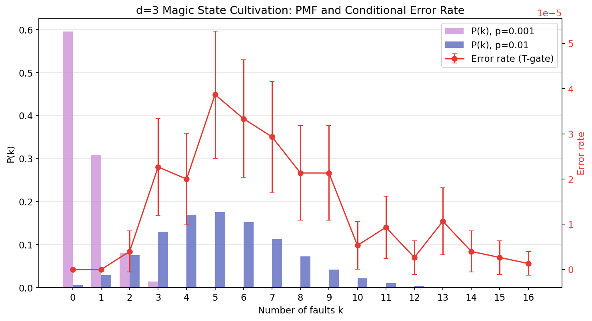
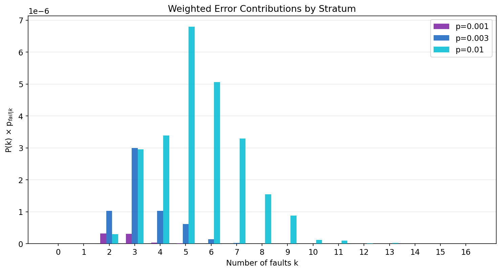
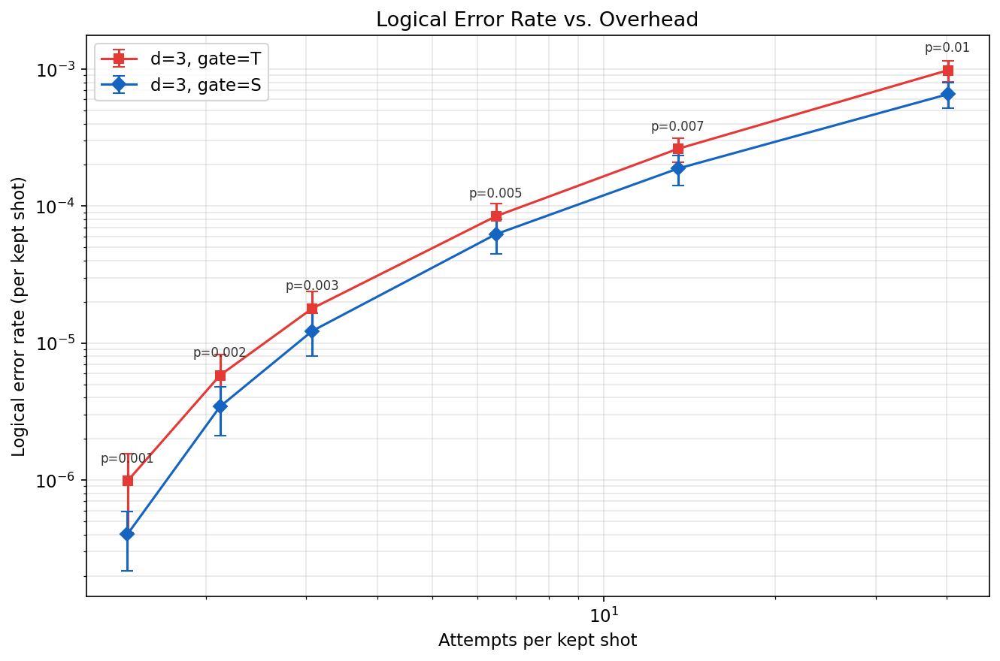

<!--pytest-codeblocks:skipfile-->

# Tutorial: Importance Sampling Magic State Cultivation

Estimating logical error rates of quantum error-correcting codes at low
physical error rates requires sampling rare events. With standard Monte
Carlo, the number of shots needed to resolve a logical error rate $p_L$
scales as $O(1 / p_L)$, so direct simulation becomes increasingly
expensive as $p_L$ decreases.

**Stratified importance sampling** solves this by conditioning on the
number of physical faults $k$ that occur in a single shot. By running
dedicated shot batches at each fault count $k$ and weighting the results
by the exact probability $P(K = k)$, we can estimate $p_L$ with
dramatically fewer total shots.

This tutorial walks through UCC's importance sampling API for the
distance-3 magic state cultivation protocol from Craig Gidney, Noah
Shutty, and Cody Jones, "Magic state cultivation: growing T states as
cheap as CNOT gates" ([arXiv:2409.17595](https://arxiv.org/abs/2409.17595)).
It focuses on simulating the injection and escape stages of the
protocol. We recreate the importance sampling analysis for this problem
from Thomas Tuloup and Thomas Ayral, "Computing logical error
thresholds with the Pauli Frame Sparse Representation"
([arXiv:2603.14670](https://arxiv.org/abs/2603.14670)), and use the d=3
T-gate and S-gate circuits distributed with Riling Li et al., "SOFT: A
High-Performance Simulator for Universal Fault-Tolerant Quantum
Circuits" ([arXiv:2512.23037](https://arxiv.org/abs/2512.23037)).

## Overview

The workflow has four steps:

1. **Compile** a noisy circuit and extract per-site fault probabilities
2. **Compute** the Binomial PMF $P(K = k)$
3. **Sample** each stratum with `sample_k_survivors`
4. **Combine** results with the stratified estimator

A bonus step shows how to **reweight** the same simulation data to
sweep over physical error rates without re-simulating.

## The Circuit

We use two d=3 magic state cultivation circuits, each operating on 15
qubits:

- **T-gate circuit** ([`circuit_d3_t_gate_p0.001.stim`](circuits/circuit_d3_t_gate_p0.001.stim)):
  Contains T/T_DAG gates (non-Clifford), which standard Clifford
  simulators like Stim cannot handle. UCC compiles and simulates the
  actual T-state preparation circuit natively.
- **S-gate circuit** ([`circuit_d3_s_gate_p0.001.stim`](circuits/circuit_d3_s_gate_p0.001.stim)):
  Contains S/S_DAG gates (Clifford). Tuloup and Ayral used this proxy
  circuit because Stim is Clifford-only. It provides a useful
  comparison point with the full T-gate protocol.

Both circuits share the same structure: 15 qubits, 20 detectors,
1 observable, and 518 noise sites at uniform $p = 0.001$.

## Step 1: Compile and Inspect

```python
import numpy as np
import ucc

# Load the circuit
with open("docs/guide/circuits/circuit_d3_t_gate_p0.001.stim") as f:
    circuit_text = f.read()

# Build an all-detector postselection mask.
# Magic state cultivation discards any shot where a detector fires.
prog_probe = ucc.compile(
    circuit_text,
    normalize_syndromes=True,
    hir_passes=ucc.default_hir_pass_manager(),
    bytecode_passes=ucc.default_bytecode_pass_manager(),
)
num_det = prog_probe.num_detectors

mask = [1] * num_det  # one flag per detector

# Compile with postselection
prog = ucc.compile(
    circuit_text,
    normalize_syndromes=True,
    postselection_mask=mask,
    hir_passes=ucc.default_hir_pass_manager(),
    bytecode_passes=ucc.default_bytecode_pass_manager(),
)

print(f"Peak rank:      {prog.peak_rank}")       # 4 (only 2^4 = 16 amplitudes)
print(f"Detectors:      {prog.num_detectors}")    # 20
print(f"Observables:    {prog.num_observables}")   # 1

# Extract per-site fault probabilities
site_probs = prog.noise_site_probabilities
print(f"Noise sites:    {len(site_probs)}")       # 518
print(f"All uniform:    {len(np.unique(site_probs)) == 1}")  # True
print(f"Site prob:      {site_probs[0]}")         # 0.001
```

The `noise_site_probabilities` property returns a 1D array covering all
fault sites: quantum noise sites (multi-channel Pauli errors) followed
by readout noise entries (bit-flip errors). For the cultivation circuit,
all 518 sites share the same probability $p = 0.001$.

## Step 2: Compute the PMF

The total fault count $K$ follows the **Binomial distribution** for
these circuits because all fault sites share the same physical error
rate:

$$
P(K = k) = \binom{N}{k} p^k (1-p)^{N-k}
$$

UCC exposes the per-site probabilities through
`program.noise_site_probabilities`. We can verify they are uniform, then
compute the PMF directly:

```python
from scipy.stats import binom

max_k = 16
assert np.allclose(site_probs, site_probs[0])
P_K = binom.pmf(np.arange(max_k + 1), len(site_probs), site_probs[0])

for k in range(max_k + 1):
    print(f"  P(K={k:2d}) = {P_K[k]:.4e}")
print(f"  Tail P(K>{max_k}) = {1.0 - sum(P_K):.2e}")
```

Output:

```
  P(K= 0) = 5.9556e-01
  P(K= 1) = 3.0881e-01
  P(K= 2) = 7.9907e-02
  P(K= 3) = 1.3758e-02
  P(K= 4) = 1.7731e-03
  P(K= 5) = 1.8245e-04
  P(K= 6) = 1.5615e-05
  P(K= 7) = 1.1433e-06
  P(K= 8) = 7.3102e-08
  P(K= 9) = 4.1466e-09
  P(K=10) = 2.1127e-10
  P(K=11) = 9.7667e-12
  P(K=12) = 4.1306e-13
  P(K=13) = 1.6093e-14
  P(K=14) = 5.8110e-16
  P(K=15) = 1.9544e-17
  P(K=16) = 6.1504e-19
  Tail P(K>16) = 7.77e-16
```

At $p = 0.001$ with 518 sites, the expected fault count is
$\mu = Np \approx 0.518$, so most shots have 0 or 1 faults. Strata
beyond $k \approx 6$ have negligible weight at this $p$, but we
sample up to $k = 16$ to support reweighting at higher physical error
rates (e.g., $p = 0.01$ where $\mu \approx 5.2$).

## Step 3: Stratified Sampling

Use `sample_k_survivors` to run shots with exactly $k$ forced faults.
The function draws the $k$ fault locations from the exact conditional
Poisson-Binomial distribution. When all site probabilities are equal
(as detected automatically), it uses an efficient $O(k)$ Fisher-Yates
sampler.

```python
shots_per_k = 750_000
stratum_data = []

for k in range(max_k + 1):
    result = ucc.sample_k_survivors(prog, shots=shots_per_k, k=k, seed=42 + k)
    stratum_data.append({
        "k": k,
        "total": result.total_shots,
        "passed": result.passed_shots,
        "errors": result.logical_errors,
    })
```

This completes in about 18 seconds on a modest machine -- simulating
12.75 million shots across 17 strata.

### Combining with the Stratified Estimator

For circuits with postselection, the survival probability depends on
$k$, so numerator and denominator must be weighted separately:

$$
p_{\text{fail}} = \frac{\sum_k P(K=k) \cdot \hat{p}_{\text{fail}|k}}
                       {\sum_k P(K=k) \cdot \hat{p}_{\text{surv}|k}}
$$

where $\hat{p}_{\text{fail}|k} = \text{errors}_k / \text{shots}_k$ and
$\hat{p}_{\text{surv}|k} = \text{passed}_k / \text{shots}_k$:

```python
weighted_errors = 0.0
weighted_survival = 0.0

for d in stratum_data:
    k = d["k"]
    total = d["total"]
    if total == 0 or P_K[k] < 1e-30:
        continue
    weighted_errors += P_K[k] * d["errors"] / total
    weighted_survival += P_K[k] * d["passed"] / total

p_fail = weighted_errors / weighted_survival
print(f"Importance sampling estimate: p_fail = {p_fail:.4e}")
```

Output:

```
Importance sampling estimate: p_fail = 9.8221e-07
```

The logical error rate is roughly $10^{-6}$. UCC is fast enough that
brute-force Monte Carlo is still possible here, but it would need far
more shots to reach comparable precision. This is where importance
sampling helps: we captured enough error events across strata to produce
a meaningful estimate with only 12.75M total shots.

## Per-Stratum Analysis

The real power of importance sampling is the per-stratum decomposition.
The plot below shows the Binomial PMF at two physical error rates (left
axis, bars) alongside the conditional error rate
$p_{\text{fail}|k}$ (right axis, red line):



Key observations:

- **k=0 and k=1 have zero logical errors**: with fewer than 2 faults,
  the cultivation protocol's postselection catches all bad shots.
- **The error rate peaks around k=5--6** at roughly $4 \times 10^{-5}$,
  then gradually declines at higher k as postselection becomes more
  aggressive (fewer survivors means fewer opportunities for errors).
- **The PMF shifts right** when $p$ increases from 0.001 to 0.01,
  but the red error rate curve stays fixed -- it depends only on the
  circuit structure, not on $p$.

The weighted contributions $P(K=k) \cdot p_{\text{fail}|k}$ show where
the logical error rate actually comes from:



At $p = 0.001$ (purple), the dominant contribution comes from k=2--3.
As $p$ increases to 0.01 (cyan), the "danger zone" shifts to k=5--6
where both the PMF weight and the error rate are substantial.

## Step 4: Error Rate Sweep via Reweighting

A key insight from Tuloup & Ayral (2026): since the conditional error
rate $p_{\text{fail}|k}$ depends on the circuit structure (which fault
locations exist and what they do) but **not** on the physical error rate
$p$, we can reweight the same simulation results with different PMFs to
sweep over $p$ without re-simulating.

For a circuit where all $N$ noise sites share the same probability $p$,
the PMF reduces to the Binomial distribution
$P(K=k) = \binom{N}{k} p^k (1-p)^{N-k}$. We also compute error bars
using the variance of the stratified estimator numerator
(Eq. 55 from Tuloup & Ayral):

$$
\text{Var}(\hat{p}_{\text{fail}}) = \sum_{k} P(k)^2
\frac{\hat{p}_{\text{fail}|k}(1 - \hat{p}_{\text{fail}|k})}{N_k}
$$

Since the survival rate has negligible statistical uncertainty compared
to the rare error rate, we divide the standard error of the numerator
by the survival rate to get the final confidence interval.

```python
from scipy.stats import binom

p_values = [0.001, 0.002, 0.003, 0.005, 0.007, 0.01]
N = len(site_probs)

for p in p_values:
    pmf = binom.pmf(np.arange(max_k + 1), N, p)
    w_err = sum(pmf[d["k"]] * d["errors"] / d["total"]
                for d in stratum_data if d["total"] > 0)
    w_surv = sum(pmf[d["k"]] * d["passed"] / d["total"]
                 for d in stratum_data if d["total"] > 0)
    # Variance of the numerator (Eq. 55)
    var_num = sum(pmf[d["k"]]**2 * (d["errors"]/d["total"])
                  * (1.0 - d["errors"]/d["total"]) / d["total"]
                  for d in stratum_data if d["total"] > 0)
    rate = w_err / w_surv if w_surv > 0 else 0.0
    ci = 1.96 * (var_num**0.5 / w_surv) if w_surv > 0 else 0.0
    disc = 1.0 - w_surv / sum(pmf)
    print(f"  p={p:.4f}: p_fail={rate:.3e} +/- {ci:.3e}, discard={disc*100:.1f}%")
```

Output:

```
  p=0.0010: p_fail=9.822e-07 +/- 5.698e-07, discard=31.3%
  p=0.0020: p_fail=5.821e-06 +/- 2.394e-06, discard=52.8%
  p=0.0030: p_fail=1.792e-05 +/- 5.912e-06, discard=67.5%
  p=0.0050: p_fail=8.439e-05 +/- 2.051e-05, discard=84.5%
  p=0.0070: p_fail=2.620e-04 +/- 5.229e-05, discard=92.6%
  p=0.0100: p_fail=9.812e-04 +/- 1.690e-04, discard=97.5%
```



The plot above shows both the **T-gate** (red squares) and **S-gate**
(blue diamonds) cultivation circuits. A single simulation run per
circuit (12.75M shots each, ~18 seconds for T and faster for S)
produced the complete error rate curves with 95% confidence intervals
across 6 physical error rates.

The x-axis shows "attempts per kept shot" -- the overhead cost of
postselection. Key observations:

- The S-gate circuit achieves a **much lower logical error rate** than
  the T-gate circuit at every physical error rate, consistent with the
  fact that S gates are Clifford operations and easier to cultivate.
- At $p = 0.01$, it takes ~40 attempts to produce one surviving shot
  for both circuits, but the T-gate error rate (~$10^{-3}$) is orders
  of magnitude higher than the S-gate rate.
- Both curves were generated from the **same reweighting approach** --
  no re-simulation needed to sweep across $p$ values.

## API Reference

### `ucc.sample_k(program, shots, k, seed=None)`

Sample with exactly `k` forced faults per shot. Returns
a `SampleResult`, just like `ucc.sample()`. Results must be weighted by $P(K=k)$ for correct
error rate estimation.

Raises `ValueError` if the stratum has zero probability mass (e.g., `k`
exceeds the number of non-zero-probability sites).

### `ucc.sample_k_survivors(program, shots, k, seed=None, keep_records=False)`

Sample survivors with exactly `k` forced faults per shot. Returns a
`SampleResult` whose `.measurements`, `.detectors`, and `.observables`
arrays contain only surviving shots. Survivor metadata is available via
`.total_shots`, `.passed_shots`, `.discards`, `.logical_errors`, and
`.observable_ones`.

Raises `ValueError` if the stratum has zero probability mass.

### `program.noise_site_probabilities`

1D numpy array of per-site total fault probabilities. Quantum noise
sites (sum of channel probabilities) come first, followed by readout
noise entries. Use for computing the fault-count PMF.

## Generating the Plots

The plots in this tutorial can be reproduced with the script at
[`docs/guide/scripts/importance_sampling_tutorial.py`](scripts/importance_sampling_tutorial.py):

```bash
uv run python docs/guide/scripts/importance_sampling_tutorial.py
```

## Further Reading

- Gidney, Shutty, and Jones (2024), "Magic state cultivation: growing T
  states as cheap as CNOT gates"
  ([arXiv:2409.17595](https://arxiv.org/abs/2409.17595)).
- Tuloup & Ayral (2026), "Computing logical error thresholds with the
  Pauli Frame Sparse Representation"
  ([arXiv:2603.14670](https://arxiv.org/abs/2603.14670)) -- introduced
  subset importance sampling for magic state cultivation.
- Li et al. (2025), "SOFT: A High-Performance Simulator for Universal
  Fault-Tolerant Quantum Circuits"
  ([arXiv:2512.23037](https://arxiv.org/abs/2512.23037)) -- source of
  the cultivation circuits used here.
