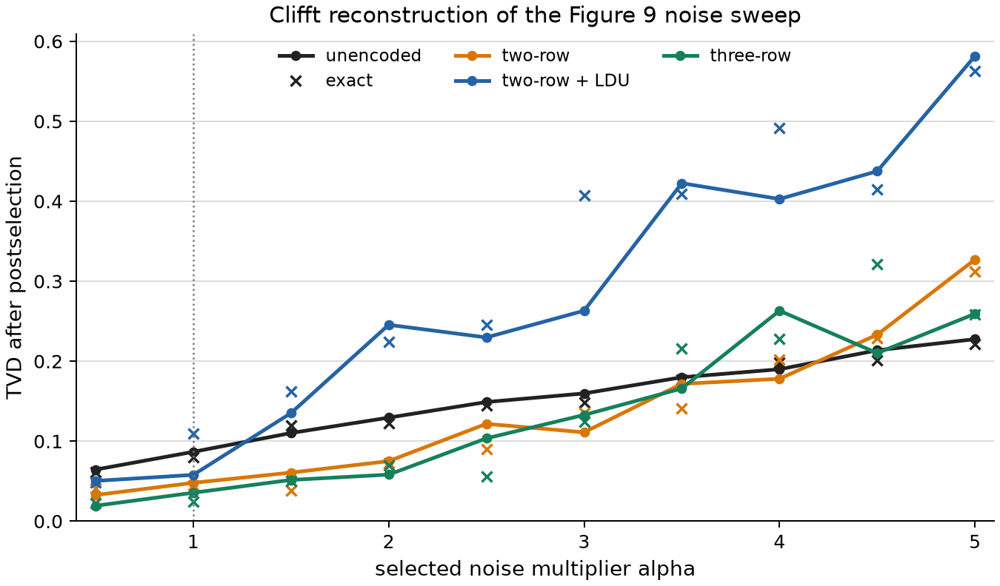
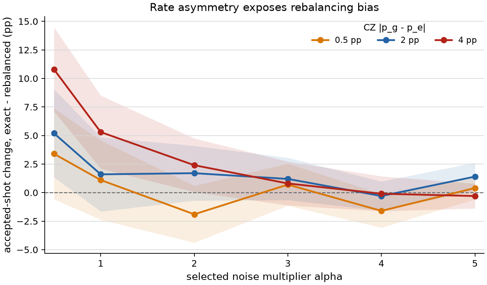

<!--pytest-codeblocks:skipfile-->

# Tutorial: Reproducing a Neutral-Atom Logical Noise Sweep

This advanced tutorial reconstructs the simulated Shor noise sweep in Figure 9
of Rines *et al.*, ["Demonstration of a Logical Architecture Uniting Motion and
In-Place Entanglement"](https://arxiv.org/abs/2509.13247), using Clifft's
five-level trajectory API and the authors' [public supplementary
artifact](https://zenodo.org/records/17137995).

The reconstruction answers two questions:

1. Can the four published physical schedules and their logical postprocessing
   reproduce the paper's noise-scaling behavior in Clifft?
2. When is the stabilizer-compatible approximation to state-dependent
   transitions measurably different from exact conditional back-action?

The first question validates a realistic end-to-end leakage workflow. The
second turns that reconstruction into a modeling study: it shows that an
approximation can preserve decoded TVD while changing which trajectories
survive postselection.

This page assumes familiarity with Clifford circuits, postselection, and the
[Leakage and Loss](leakage-and-loss.md) API. For a smaller first example, start
with [Delayed Loss in a Surface Code](delayed-loss.md).

## The logical experiment

The experiment implements a precompiled order-finding instance for `N=15` and
`a=11`. The remaining quantum workload is a three-qubit Clifford circuit with
ideal output distribution

$$
P(000) = P(010) = P(101) = P(111) = \frac{1}{4}.
$$

The paper realizes that logical circuit with four physical schedules:

| Schedule | Physical realization | CZ gates |
|---|---|---:|
| Unencoded | Three physical atoms | 2 |
| Two row | Two `[[4, 2, 2]]` code patches | 11 |
| Three row | Three code patches producing two samples per shot | 22 |
| Two row with LDU | Two patches plus eight leakage-detection flags | 27 |

The `[[4, 2, 2]]` code detects a single physical-qubit error. Its stabilizers
are `XXXX` and `ZZZZ`, so invalid codewords can be rejected but an arbitrary
single error cannot be corrected. The leakage-detection unit, or LDU, adds two
controlled operations and a flag measurement for each encoded data atom. A
computational atom flips its flag once; a leaked atom does not participate and
leaves the flag set.

## Checked-in Clifft circuits

The four final schedules are included with the documentation:

- [`unencoded_alpha1.stim`](circuits/neutral_atom/unencoded_alpha1.stim)
- [`two_row_alpha1.stim`](circuits/neutral_atom/two_row_alpha1.stim)
- [`three_row_alpha1.stim`](circuits/neutral_atom/three_row_alpha1.stim)
- [`two_row_ldu_alpha1.stim`](circuits/neutral_atom/two_row_ldu_alpha1.stim)

They use Clifft's Stim-superset text format and do not require Cirq. The export
preserves terminal measurement order and resolves physical atom motion into the
wire labels used by later operations. A move is therefore not represented as a
quantum `SWAP`. Its phase error appears as `Z_ERROR` on the atoms that arrived
at their new sites.

The files record the nominal `alpha=1` probabilities. The runnable script
rescales the selected terms in memory, so the complete sweep needs only these
four circuits. The [`README.txt`](circuits/neutral_atom/README.txt) records
their public source and license.

## Map the five-level noise model

The circuits contain the Clifford operations and ordinary Pauli noise. A
physical phase rotation, for example, becomes a named Clifford rotation, a
twirled phase error, and an explicit level-transition site:

```stim
SQRT_Z_DAG 10
Z_ERROR(8.8823809595495095e-05) 10
LEVEL_TRANSITION[RZ_TRANSITION] 10
```

The effects that change or observe the atom's level live in
`noncomp.Model`:

```python
model = noncomp.Model(
    initial_state=INITIAL_LEVELS,
    transitions={
        "CZ": cz_transition,
        "RZ_TRANSITION": rz_transition,
    },
    classifier=noncomp.Classifier(classifier_matrix),
    reset_restores_lost=False,
    damping="exact",
)
```

`initial_state` prepares a distribution over `g`, `e`, `leak_g`, `leak_e`, and
`lost`. Transition matrices use `T[to][from]`. The `CZ` key is a gate hook,
while `RZ_TRANSITION` is referenced explicitly because `RZ` means reset in the
Stim instruction set. The three-symbol classifier produces zero, one, or a
heralded loss at measurement.

The full numeric matrices and classifier are kept in the runnable
[`neutral_atom_leakage_tutorial.py`](scripts/neutral_atom_leakage_tutorial.py).
Keeping them visible there makes it possible to inspect or modify the physical
model without regenerating the circuits.

## Rebalanced and exact no-jump behavior

A transition event collapses its computational source against the live quantum
state. The absence of an event also carries information when the total event
rates differ between `g` and `e`. For rates $p_g$ and $p_e$, the surviving
component receives the filter

$$
K_{\mathrm{stay}} = \sqrt{1-p_g}\lvert g\rangle\!\langle g\rvert
                   + \sqrt{1-p_e}\lvert e\rangle\!\langle e\rvert.
$$

The tutorial exposes two model choices:

- `matched` adds a diagonal self-jump to the lower-rate computational source
  until the two total rates agree. The resulting no-jump filter is proportional
  to identity, so `damping="neglect"` is exact for the transformed matrices.
  This is the stabilizer-compatible model used for the reproduction.
- `exact` keeps the unequal rates and uses `damping="exact"`. Clifft applies
  the conditional no-jump filter and promotes coherent sites when required.

The circuit, initial population, readout model, Pauli twirls, and decoder remain
the same. Only the treatment of unequal transition rates changes.

## Reproduce the Figure 9 noise sweep

The paper varies a multiplier $\alpha$ from 0.5 to 5. In the public model,
$\alpha$ scales the CZ phase error, physical-RZ overrotation, and movement
phase error. It does not scale the transition matrices, initial level
population, readout classifier, or static global-pulse error. The script keeps
that distinction; `alpha=1` is the nominal model stored in the circuit files.



Color identifies the physical realization and lower TVD is better. Solid
curves with circles use the rebalanced model; crosses use exact no-jump
back-action. Each checked-in point uses 2,000 trajectories per model. The
rebalanced curves reproduce the published ordering: the encoded schedules
initially outperform the unencoded circuit, while their advantage disappears
as the selected noise terms grow.

The exact markers mostly track the same TVD curves. The important caveat is
visible at large $\alpha$: the encoded schedules, especially the LDU circuit,
accept few shots, so TVD among the survivors becomes a noisy way to compare
models. Acceptance is the more sensitive observable for the approximation.

## Stress-test the approximation

To isolate that effect, keep the real two-row LDU schedule and vary the CZ
computational-rate asymmetry $\lvert p_g-p_e\rvert$. For each point, the script
preserves the mean CZ event rate and each source column's conditional
distribution over jump destinations. It equalizes the smaller RZ asymmetry in
both arms, leaving CZ no-jump back-action as the controlled difference.



The vertical axis is the exact accepted-shot rate minus the rebalanced rate,
in percentage points. Bands are pointwise 95% normal intervals from the two
binomial acceptance estimates. The 0.5-point curve is close to the published
CZ asymmetry; 2 and 4 points are hypothetical stress tests, not new hardware
fits.

At low noise, the estimated shift grows with the rate asymmetry. The absolute
difference eventually shrinks because very few trajectories survive either
model. With 1,000 trajectories per model and point, the bands are deliberately
wide; increase `--asymmetry-shots` before drawing quantitative conclusions.
The qualitative lesson is still visible: checking only decoded distributions
can miss a modeling bias because conditional back-action changes the
postselected ensemble itself.

The conclusion is not that the published approximation was unusable. Its
physical asymmetry is mild. The useful result is that Clifft lets us validate
the approximation on the actual logical workload and remove it when a device
or protocol has more state-dependent transition rates.

## Run the reconstruction

For a quick `alpha=1` table across the four schedules:

```bash
uv run python docs/guide/scripts/neutral_atom_leakage_tutorial.py
```

To compare both no-jump models at one point:

```bash
uv run python docs/guide/scripts/neutral_atom_leakage_tutorial.py \
  --circuits two_row_ldu --models matched exact --shots 5000
```

To regenerate both figures at tutorial-friendly precision:

```bash
uv run --with matplotlib python \
  docs/guide/scripts/neutral_atom_leakage_tutorial.py --figures
```

That command uses the same fixed seed and sampling budgets as the checked-in
images: 2,000 trajectories per model and Figure 9 point and 1,000 per model and
asymmetry point. For smoother curves and narrower acceptance intervals, raise
`--figure9-shots` and `--asymmetry-shots`.

The script converts Clifft's measurement and herald arrays to the public
artifact's three-symbol records, then:

1. rejects invalid preparation or LDU flags;
2. rejects or corrects a single loss according to the selected schedule;
3. decodes each valid `[[4, 2, 2]]` block into two logical bits; and
4. compares the logical Shor distribution with the ideal distribution using
   total variation distance.

The three-row schedule emits two logical samples per accepted physical
trajectory; the reported acceptance accounts for that.

## Scope and provenance

This is a lightweight reconstruction built from four checked-in final circuits,
not a general Cirq-to-Clifft converter. It does not recreate the paper's
hardware data or experimental confidence intervals. The source schedules,
noise parameters, and decoder come from the Apache-2.0 supplementary artifact
recorded with the circuits.

The model retains the artifact's Pauli twirls for coherent pulse errors, so the
`exact` comparison changes the unequal-rate no-jump treatment rather than
claiming a new hardware fit.

See [Noncomputational States](../theory/noncomputational.md) for the trajectory
semantics and active-width cost of exact damping.
