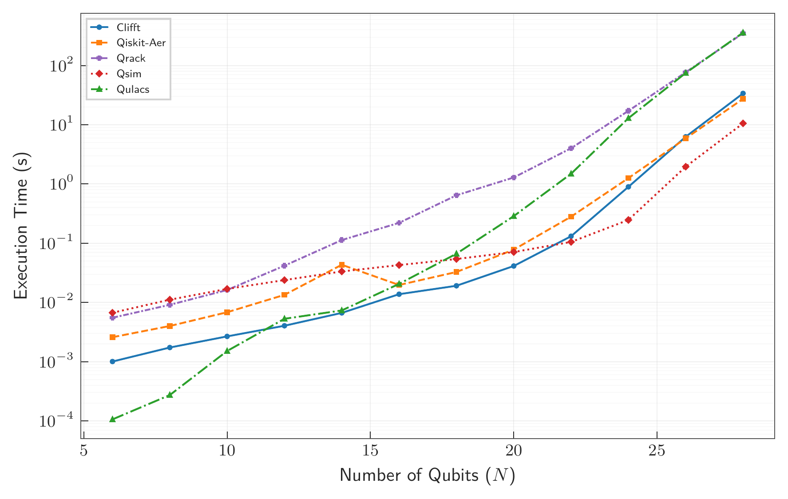

# Performance

Clifft is optimized for circuits that sit between pure stabilizer simulation and
fully dense statevector simulation: large circuits with mostly Clifford
structure, localized non-Clifford operations, noise, measurements, detectors,
and observables.

The main quantity to watch is the peak active dimension `k`. Non-Clifford
operations can increase `k`, while measurements can reduce it. When `k` stays
small relative to the total number of physical qubits, Clifft can sample large
circuits exactly at high throughput.

## Summary

| Regime | Recommended tool | What the benchmarks show |
|---|---|---|
| Pure Clifford QEC | Stim | Stim remains faster for fully Clifford circuits. Clifft is useful here mainly when you want one workflow that also supports nearby non-Clifford variants. |
| Low-magic / near-Clifford FT circuits | Clifft | Clifft gives its largest gains when non-Clifford effects remain localized and frequent measurements keep `k` small. |
| Dense universal circuits | Statevector tools or Clifft | When `k = n`, Clifft behaves like a dense statevector simulator and remains competitive with leading CPU simulators. |

Clifft is not intended to replace Stim for fully Clifford workloads. Its main
target is the middle regime where exact non-Clifford effects matter, but the
non-Clifford activity remains small enough to avoid full dense-statevector
scaling.

## QEC benchmark throughput

The table below reports sample-time throughput in effective shots per second.
`kmax` is the peak active virtual dimension reached during execution. For
near-Clifford circuits, this is often a better predictor of Clifft performance
than the total qubit count or raw non-Clifford operation count.

| Circuit | Qubits | Ops | Non-Clifford ops | `kmax` | Clifft | Stim | Tsim |
|---|---:|---:|---:|---:|---:|---:|---:|
| Surface code `d=7, r=7` | 118 | 4,667 | 0 | 0 | 2.2M | 20.1M | 314.7k |
| Cultivation `d=3` | 15 | 676 | 29 | 4 | 10.4M | — | 27.9k |
| Cultivation `d=5` | 42 | 4,379 | 91 | 10 | 314.4k | — | DNC |
| Distillation | 85 | 1,163 | 10 | 5 | 1.5M | — | 1.5M |
| Surface code `d=3, r=1` with coherent noise | 26 | 173 | 65 | 5 | 19.4M | — | 14.4M |
| Surface code `d=3, r=3` with coherent noise | 26 | 415 | 195 | 8 | 1.7M | — | DNC |
| Surface code `d=5, r=1` with coherent noise | 64 | 533 | 209 | 13 | 133.1k | — | 570.9k |
| Surface code `d=5, r=5` with coherent noise | 64 | 2,073 | 1,045 | 24 | 0.7 | — | DNC |

`DNC` means the circuit did not compile within the benchmark time limit. Stim
entries are shown as `—` for non-Clifford circuits because Stim does not support
those operations directly.

These numbers should be read as representative benchmark points, not as universal
performance guarantees. Throughput depends on the circuit structure, noise model,
measurement schedule, active dimension, and hardware.

## Interpreting the results

### Pure Clifford circuits

For fully Clifford circuits, Stim remains the right tool. It is purpose-built for
that regime and can vectorize stabilizer-frame work across many shots.

Clifft pays some overhead to maintain the frame-factored representation even when
`kmax = 0`. The benefit is that the same workflow can also support non-Clifford
variants of the circuit.

### Low-magic fault-tolerant circuits

This is Clifft's main target regime. In circuits such as magic-state cultivation,
the physical circuit can involve many operations and many qubits, but the
non-Clifford effects remain localized. Frequent measurements can also shrink the
active state during execution.

In this setting, Clifft can avoid dense-statevector scaling in the full physical
qubit count and instead operate on the smaller active state.

### Coherent-noise and larger-`k` circuits

The coherent-noise benchmarks show how performance changes as `kmax` grows. As
the active dimension increases, Clifft gradually transitions toward dense
statevector behavior. This is expected: active-state operations scale
exponentially in `k`.

The important point is that the transition is controlled by the active dimension,
not simply by the total number of physical qubits.

## Dense-statevector limit

When `k = n`, Clifft no longer benefits from near-Clifford structure and behaves
like a dense statevector simulator. This is not its primary target regime, but it
is still useful to understand the worst case.

On random Quantum Volume circuits at depth `D = N`, Clifft remains competitive
with leading CPU statevector simulators such as Qiskit Aer, qsim, Qrack, and
Qulacs.

## Hardware and methodology notes

The benchmark table reports sample-time throughput. Clifft and Stim were run on
a single cloud CPU instance, while Tsim was run on a GPU instance. The benchmark
values are intended to compare practical throughput on representative hardware,
not to isolate every architectural difference between CPUs and GPUs.

Compilation time is amortized for Clifft and Stim. For the QEC circuits shown
above, Clifft compilation is small compared with repeated sampling. Tsim numbers
exclude compilation time and a warmup run.

Some simulators are sensitive to physical noise rate, circuit structure, and
backend-specific optimizations. In particular, non-Clifford operation count alone
is not enough to predict performance. For Clifft, the most important quantities
are the active dimension `k`, how long the circuit spends at each active
dimension, and whether measurements collapse the active state.

## Reproducing benchmarks

The full benchmark methodology, hardware details, circuits, and analysis scripts
are described in the Clifft paper and companion benchmark repository.

- Paper: [https://arxiv.org/abs/2604.27058](TODO)
- Benchmark circuits and scripts: [clifft-paper](https://github.com/unitaryfoundation/clifft-paper)
