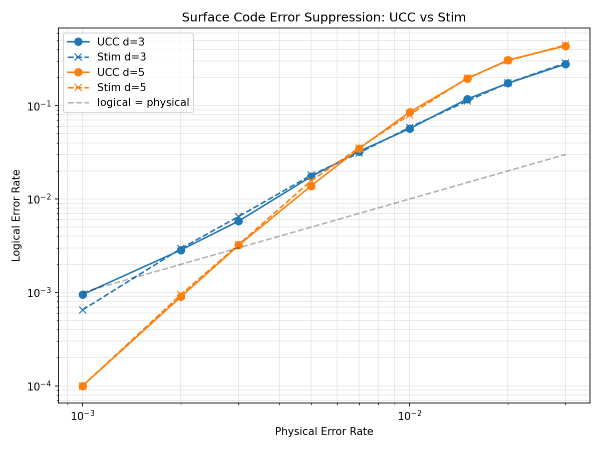

<!--pytest-codeblocks:skipfile-->

# Tutorial: Surface Code Error Suppression

This tutorial demonstrates using UCC as a sampling backend for quantum error correction experiments. We reproduce a surface code error suppression plot similar to Stim's [getting started notebook](https://github.com/quantumlib/Stim/blob/main/doc/getting_started.ipynb), running **both UCC and Stim** side-by-side to verify statistical equivalence and compare performance. Since this is a Clifford-only circuit, we expect Stim to outperform UCC. But it's still instructive to confirm they give similar results, and to understand UCC's relative performance on Clifford-only circuits.

We use [PyMatching](https://github.com/oscarhiggott/PyMatching) for minimum-weight perfect matching (MWPM) decoding on both backends.



## Pipeline

The experiment follows four steps, executed for both backends:

1. **Generate** a rotated surface code memory-Z circuit with `stim.Circuit.generated()`
2. **Compile** the circuit (UCC: `ucc.compile()` with full optimization; Stim: `compile_detector_sampler()`)
3. **Sample** detector and observable data, timing each backend
4. **Decode** detector syndromes with PyMatching's MWPM decoder and compare logical error rates

## Prerequisites

```bash
pip install ucc stim pymatching matplotlib numpy
```

## Full Code

```python
import time

import matplotlib.pyplot as plt
import numpy as np
import pymatching
import stim

import ucc


def generate_surface_code_circuit(
    distance: int,
    rounds: int,
    phys_error_rate: float,
) -> stim.Circuit:
    """Generate a rotated surface code memory-Z experiment."""
    return stim.Circuit.generated(
        "surface_code:rotated_memory_z",
        rounds=rounds,
        distance=distance,
        after_clifford_depolarization=phys_error_rate,
        after_reset_flip_probability=phys_error_rate,
        before_measure_flip_probability=phys_error_rate,
        before_round_data_depolarization=phys_error_rate,
    )


def decode_logical_error_rate(
    det: np.ndarray,
    obs: np.ndarray,
    circuit: stim.Circuit,
) -> float:
    """Decode detector syndromes and compute the logical error rate."""
    dem = circuit.detector_error_model(decompose_errors=True)
    matching = pymatching.Matching.from_detector_error_model(dem)
    predictions = matching.decode_batch(det)
    num_errors = int(np.sum(predictions[:, 0] ^ obs[:, 0]))
    return num_errors / det.shape[0]


def run_ucc(
    circuit: stim.Circuit, shots: int
) -> tuple[float, float, float]:
    """Compile and sample with UCC.

    Returns (logical_error_rate, compile_seconds, sample_seconds).
    """
    stim_text = str(circuit)
    hir_pm = ucc.default_hir_pass_manager()
    bpm = ucc.default_bytecode_pass_manager()

    t0 = time.perf_counter()
    prog = ucc.compile(stim_text, hir_passes=hir_pm, bytecode_passes=bpm)
    compile_s = time.perf_counter() - t0

    t0 = time.perf_counter()
    _meas, det, obs = ucc.sample(prog, shots)
    sample_s = time.perf_counter() - t0

    logical_err = decode_logical_error_rate(det, obs, circuit)
    return logical_err, compile_s, sample_s


def run_stim(
    circuit: stim.Circuit, shots: int
) -> tuple[float, float, float]:
    """Compile and sample with Stim.

    Returns (logical_error_rate, compile_seconds, sample_seconds).
    """
    t0 = time.perf_counter()
    sampler = circuit.compile_detector_sampler()
    compile_s = time.perf_counter() - t0

    t0 = time.perf_counter()
    det, obs = sampler.sample(shots, separate_observables=True)
    sample_s = time.perf_counter() - t0

    logical_err = decode_logical_error_rate(det, obs, circuit)
    return logical_err, compile_s, sample_s


# -- Experiment parameters --
distances = [3, 5]
phys_error_rates = [
    0.001, 0.002, 0.003, 0.005, 0.007, 0.01, 0.015, 0.02, 0.03,
]
shots = 20_000

# -- Collect data --
ucc_results: dict[int, list[float]] = {}
stim_results: dict[int, list[float]] = {}
timing_rows: list[tuple[int, float, float, float, float, float]] = []

for d in distances:
    ucc_results[d] = []
    stim_results[d] = []
    for p in phys_error_rates:
        circuit = generate_surface_code_circuit(d, rounds=d, phys_error_rate=p)

        ucc_err, ucc_comp, ucc_samp = run_ucc(circuit, shots)
        stim_err, stim_comp, stim_samp = run_stim(circuit, shots)

        ucc_results[d].append(ucc_err)
        stim_results[d].append(stim_err)
        timing_rows.append((d, p, ucc_comp, ucc_samp, stim_comp, stim_samp))

        print(
            f"d={d}  p={p:.4f}  "
            f"UCC={ucc_err:.5f} ({ucc_comp*1e3:.1f}ms + {ucc_samp:.3f}s)  "
            f"Stim={stim_err:.5f} ({stim_comp*1e3:.1f}ms + {stim_samp:.3f}s)"
        )

# -- Timing summary --
print("\n--- Timing Summary ---")
print(
    f"{'d':>3} {'p':>7} "
    f"{'UCC compile':>13} {'UCC sample':>12} "
    f"{'Stim compile':>13} {'Stim sample':>12}"
)
for d, p, uc, us, sc, ss in timing_rows:
    print(
        f"{d:>3} {p:>7.4f} "
        f"{uc*1e3:>11.1f}ms {us:>10.3f}s "
        f"{sc*1e3:>11.1f}ms {ss:>10.3f}s"
    )

# -- Plot --
fig, ax = plt.subplots(figsize=(8, 6))
colors = ["#1f77b4", "#ff7f0e"]
for i, d in enumerate(distances):
    ax.plot(
        phys_error_rates, ucc_results[d],
        "o-", color=colors[i], label=f"UCC d={d}", markersize=7,
    )
    ax.plot(
        phys_error_rates, stim_results[d],
        "x--", color=colors[i], label=f"Stim d={d}", markersize=7,
    )

ax.plot(
    phys_error_rates, phys_error_rates,
    "k--", alpha=0.3, label="logical = physical",
)
ax.set_xscale("log")
ax.set_yscale("log")
ax.set_xlabel("Physical Error Rate")
ax.set_ylabel("Logical Error Rate")
ax.set_title("Surface Code Error Suppression: UCC vs Stim")
ax.legend()
ax.grid(True, which="both", alpha=0.3)
plt.tight_layout()
plt.savefig("surface_code.png", dpi=150)
plt.show()
```

## How It Works

### Circuit Generation

Stim generates the full noisy surface code circuit including:

- Data qubit initialization and measurement
- Stabilizer measurement rounds with ancilla qubits
- Depolarizing noise after Clifford gates, reset, and measurement
- `DETECTOR` annotations marking parity checks
- `OBSERVABLE_INCLUDE` annotations for logical observable tracking

For distance $d$, the rotated surface code has $d^2$ data qubits and $(d^2 - 1)/2$ ancilla qubits. Stim allocates qubit indices on a 2D coordinate grid, so the total qubit index count is higher: distance 3 uses 26 qubit indices, and distance 5 uses 64.

### UCC Compilation & Sampling

`ucc.compile()` accepts the full Stim circuit text — including `REPEAT` blocks, noise channels, `DETECTOR` and `OBSERVABLE_INCLUDE` annotations. In this tutorial, we use the full optimization pipeline:

- **HIR passes** (`ucc.default_hir_pass_manager()`): Peephole fusion on the Heisenberg IR
- **Bytecode passes** (`ucc.default_bytecode_pass_manager()`): Noise block coalescing, multi-gate fusion, expand-T fusion, and swap-measure optimization

The compiled program is then sampled with `ucc.sample()`, which returns three arrays:

- **measurements**: raw measurement outcomes
- **detectors**: detector values (syndrome bits)
- **observables**: logical observable outcomes

### Stim Compilation & Sampling

Stim's `compile_detector_sampler()` compiles the circuit into an optimized Clifford-frame simulator. Like UCC, Stim resolves deterministic Clifford impacts at compile time. Because Stim is restricted to Clifford+noise circuits, it never maintains an active statevector and can vectorize sampling across many shots simultaneously using SIMD instructions, making it extremely fast for this class of circuits.

### Decoding

Both backends produce detector and observable arrays in the same format. PyMatching constructs a matching graph from Stim's detector error model and performs MWPM decoding on the detector syndromes. The logical error rate is the fraction of shots where the decoder's prediction disagrees with the actual observable value.

### Results

The plot confirms that UCC and Stim produce statistically equivalent logical error rates across all tested distances and physical error rates. Both curves overlap closely, with only shot-noise fluctuations between them.

The classic threshold behavior of the surface code is visible:

- **Below threshold** (~$p = 0.005$): increasing distance $d$ exponentially suppresses logical errors. At $p = 0.001$, distance 5 achieves roughly $10\times$ lower logical error rate than distance 3.
- **Above threshold**: larger codes perform *worse* because they have more opportunities for errors to accumulate.
- The crossover point is the **threshold** of the surface code under this noise model.

### Performance Comparison

Representative timing on an x86-64 Linux system (20,000 shots):

| | UCC (d=3) | Stim (d=3) | UCC (d=5) | Stim (d=5) |
|---|---|---|---|---|
| **Compile** | ~2 ms | ~0.1 ms | ~13 ms | ~0.1 ms |
| **Sample** | ~20 ms | ~5 ms | ~120 ms | ~20 ms |

Both UCC and Stim have a similar compilation phase that resolves deterministic Clifford impacts ahead of time. The sampling speed difference comes down to vectorization: because Stim is Clifford-only, it never needs an active statevector array, so it can pack the Pauli frame and measurement sampling into wide SIMD operations — processing hundreds of shots per instruction. UCC's Schrodinger VM must be ready for non-Clifford gates (like T) to appear at any point, so it cannot vectorize across shots as aggressively. In practice, Stim's advantage on pure stabilizer circuits scales with the native SIMD bitwidth of the architecture (e.g., ~256x for AVX2). The key takeaway is that UCC produces **correct results** — the logical error rates agree — while offering a compilation pipeline that generalizes beyond stabilizer circuits.

!!! note "Current qubit limit"
    UCC's default build supports up to 64 qubits, which accommodates distances
    3 (26 qubit indices) and 5 (64 qubit indices). For larger circuits like
    distance 7 (118 qubit indices), rebuild with `UCC_MAX_QUBITS=128` or higher.
    See [Building from Source](../development/building.md#ucc_max_qubits) for details.
