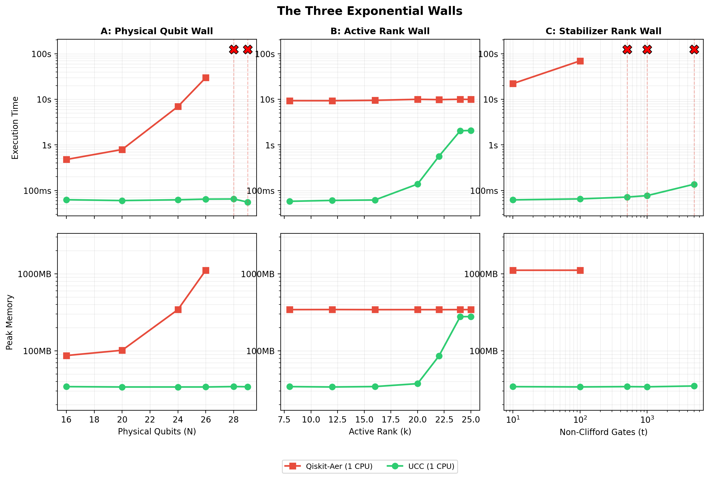

# Benchmark Results: Three Exponential Walls (Local Run)

## Machine Specs

| Component | Details |
|-----------|------------------------------------------|
| CPU | Intel Xeon Platinum 8259CL @ 2.50GHz |
| Cores | 2 vCPUs |
| RAM | 7.2 GB |
| OS | Ubuntu 24.04.3 LTS (kernel 6.12.42) |
| Python | 3.12.3 |
| UCC | 0.1.0 |
| Qiskit | 2.3.0 |
| Qiskit-Aer | 0.17.2 |

Both simulators were restricted to **1 CPU thread** (`OMP_NUM_THREADS=1`,
`MKL_NUM_THREADS=1`, `max_parallel_threads=1`).

A per-worker memory cap of **6.5 GB** (`RLIMIT_AS`) was enforced to prevent
swap-thrash. The theoretical OOM cutoff was set at 7 GB with 2 GB headroom.

## Sweep Parameters

| Panel | Fixed | Swept | Tools |
|-------|-------|-------|-------|
| A: Physical Qubit Wall | k=12, t=20 | N = 16, 20, 24, 26, 28, 29 | Qiskit, UCC |
| B: Active Rank Wall | N=24, t=40 | k = 8, 12, 16, 20, 22, 24, 25 | Qiskit, UCC |
| C: Stabilizer Rank Wall | N=26, k=12 | t = 10, 100, 500, 1000, 5000 | Qiskit, UCC |

## Results Summary

### Panel A: Physical Qubit Wall

Qiskit allocates a dense 2^N statevector. UCC only tracks the 2^k active
subspace (k=12 here, so 64 KB regardless of N).

| N | Qiskit Time | Qiskit Memory | UCC Time | UCC Memory |
|-----|-------------|---------------|----------|------------|
| 16 | 0.48s | 87 MB | 0.06s | 34 MB |
| 20 | 0.79s | 102 MB | 0.06s | 34 MB |
| 24 | 6.92s | 342 MB | 0.06s | 34 MB |
| 26 | 29.82s | 1,110 MB | 0.06s | 34 MB |
| 28 | TIMEOUT | -- | 0.07s | 34 MB |
| 29 | OOM | -- | 0.06s | 34 MB |

Qiskit hits a timeout at N=28 (4 GB statevector) and cannot even allocate at
N=29 (8 GB). UCC is **flat at ~60ms** across all N values -- a **500x speedup**
at N=26 and effectively infinite at N>=28.

### Panel B: Active Rank Wall

With N=24 fixed, Qiskit always allocates 2^24 = 256 MB (plus overhead = ~342 MB).
UCC's cost scales with the active rank k.

| k | Qiskit Time | Qiskit Memory | UCC Time | UCC Memory |
|-----|-------------|---------------|----------|------------|
| 8 | 9.32s | 342 MB | 0.06s | 34 MB |
| 12 | 9.31s | 343 MB | 0.06s | 34 MB |
| 16 | 9.49s | 342 MB | 0.06s | 34 MB |
| 20 | 9.97s | 342 MB | 0.14s | 37 MB |
| 22 | 9.83s | 342 MB | 0.56s | 85 MB |
| 24 | 9.99s | 342 MB | 2.04s | 277 MB |
| 25 | 9.92s | 342 MB | 2.07s | 278 MB |

Qiskit is flat -- it has no concept of active rank. UCC starts 155x faster at
k=8 and converges toward Qiskit's cost as k approaches N. At k=24 (where
UCC's active array equals Qiskit's full statevector) UCC is still **5x faster**
due to avoiding Qiskit's transpilation overhead.

### Panel C: Stabilizer Rank Wall

Both simulators scale linearly in t (each T-gate is O(2^N) or O(2^k) work),
but UCC's constant factor is 2^12 vs Qiskit's 2^26 -- a 16,384x difference.

| t | Qiskit Time | Qiskit Memory | UCC Time | UCC Memory |
|------|-------------|---------------|----------|------------|
| 10 | 22.07s | 1,110 MB | 0.06s | 34 MB |
| 100 | 69.59s | 1,111 MB | 0.07s | 34 MB |
| 500 | TIMEOUT | -- | 0.07s | 34 MB |
| 1000 | TIMEOUT | -- | 0.08s | 34 MB |
| 5000 | TIMEOUT | -- | 0.14s | 35 MB |

Qiskit times out at t>=500. UCC handles 5000 T-gates in 140ms.

## Plot

Top row: execution time (log scale). Bottom row: peak memory (log scale).
Red X markers indicate TIMEOUT or OOM failures.
