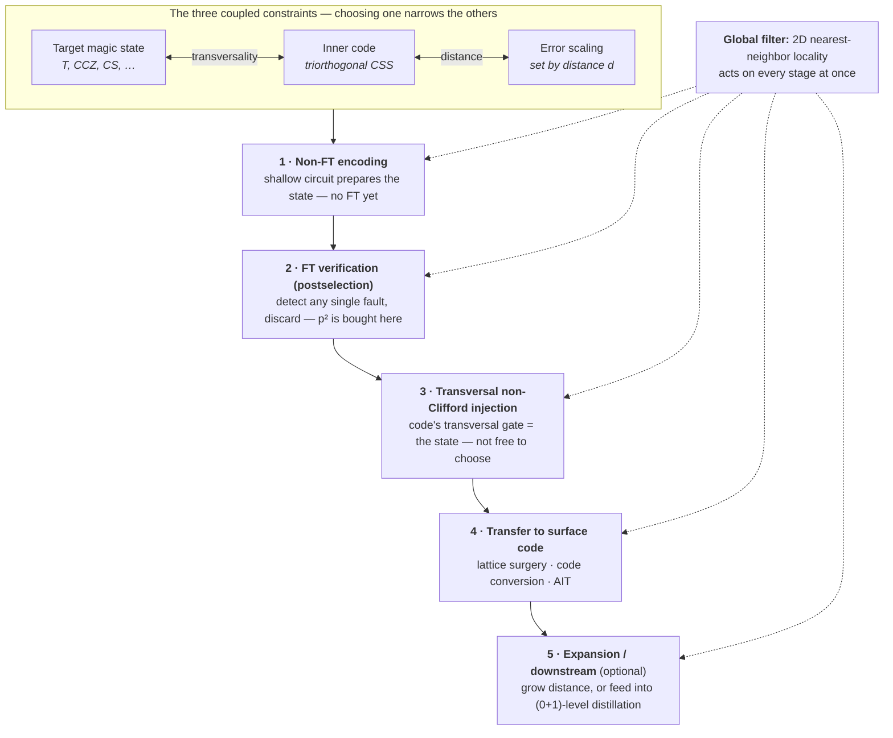

# A Design Framework for Zero-Level Magic State Distillation

*A reconstruction unifying two protocols: zero-level T-state distillation (Itogawa, Takada, Hirano, Fujii, arXiv:2403.03991) and zero-level CCZ distillation (Itogawa, Hirano, Akahoshi, Fujii, arXiv:2605.21867).*

---

## TL;DR

The two papers look like they vary two independent knobs — "which magic state" and "which code." They do not. The choice of magic state **determines** the admissible codes through an algebraic constraint (transversality), and the choice of code **determines** the achievable error scaling through a combinatorial constraint (distance and detection structure). The design problem is not a product space of independent choices; it is a **dependency graph**, and finding new protocols means finding consistent paths through it.

Below: the shared pipeline, the hard constraint that couples state to code, the soft constraints that separate a *valid* protocol from a *good* one, a mechanizable search procedure, and the open territory the framework exposes.

---

## 1. The common skeleton

Conventional magic state distillation (MSD) runs at the *logical* level: every qubit of the distillation circuit is encoded into a full QEC code, error-corrected Clifford gates are applied, and distillation proceeds. Fault-tolerant, but spatially enormous — historically *the* bottleneck in FTQC resource estimates.

**Zero-level** distillation runs the entire distillation circuit at the *physical* level — bare physical qubits, nearest-neighbor two-qubit gates, on a 2D square lattice — and achieves fault tolerance through **error detection / postselection** rather than correction. Because any single-fault event is detected and the run discarded, the output logical error rate scales as roughly the **square** of the physical error rate (∝ p²) instead of linearly. The distilled state lives on a small code and is then transferred (via lattice surgery) into a surface code for downstream use.

The entire pitch is reducing **space-time overhead** for *early* FTQC, where there are too few qubits to run multilevel logical distillation.

---

## 2. The five-stage pipeline

Every zero-level protocol — in both papers, and any you would construct — factors into the same five stages. Naming them sharply is most of the battle.

| Stage | What it does | What it costs / buys |
|---|---|---|
| **1 — Non-FT encoding** | Prepare the target stabilizer state (`\|+++⟩`, `\|+⟩`, `\|0⟩^⊗n`) in the inner code with a minimal-depth, *non*-fault-tolerant circuit. | Cheap, shallow by design. Allowed to be non-FT because Stage 2 cleans it up. |
| **2 — FT verification** | Detect any single fault and postselect (discard on failure). | **This is where p² is bought.** The heart of "zero-level." |
| **3 — Transversal non-Clifford injection** | Apply the physical-gate pattern that, by the code's algebraic structure, implements the desired logical non-Clifford gate transversally. | **This step picks your magic state for you** — it is not a free choice. |
| **4 — Transfer to surface code** | Move the distilled state into a surface code via lattice surgery, code conversion, or AIT (directly into a high-distance code). | Sets the output code distance and the surgery overhead. |
| **5 — Expansion / downstream** (optional) | Grow the surface-code distance, or feed output into higher-level distillation (the "(0+1)-level" idea). | Trades success rate / overhead for a lower error floor. |

A **global filter** sits across all five stages: the **2D nearest-neighbor locality constraint**. It is not a stage — it is a predicate every stage must satisfy simultaneously, and it is what kills most otherwise-valid candidates.

### Dependency graph

---

## 3. The hard constraint: transversality fixes the state–code pairing

This is the load-bearing wall.

By **Eastin–Knill**, no code admits a transversal *universal* gate set; some non-Clifford gate must come from elsewhere. Zero-level distillation's entire trick is to pick a code whose *one* available transversal non-Clifford gate **is** the gate that produces the target magic state. You do not choose state and code independently — you choose a `(code, transversal-non-Clifford-gate)` pair, and the gate dictates the state.

The relevant algebra is **triorthogonality** (and its generalizations). A binary matrix `G` (rows = X-type stabilizer generators and logical-X representatives) is triorthogonal when its rows satisfy weight/overlap divisibility conditions mod 2. The Bravyi–Haah theorem: transversal T on the physical qubits implements a logical operation determined by the cubic form

$$ \sum_{i<j<k} (\text{row}_i \cdot \text{row}_j \cdot \text{row}_k) $$

evaluated over the logical generators.

- **One logical qubit**, cubic form → a single logical T ⟹ a **T state**. (15-qubit Reed–Muller is the textbook example; the Steane code reaches T-related resources through its transversal *H* plus a Hadamard test — a slightly different mechanism.)
- **Three logical qubits**, cubic form → logical **CCZ** ⟹ a **CCZ state**. The **⟦8,3,2⟧ code** is the minimal such code — *exactly* why the 2026 paper uses it, and why its transversal pattern is

$$ \overline{CCZ} = T_0 T_1^\dagger T_2^\dagger T_3 T_4^\dagger T_5 T_6 T_7^\dagger. $$

  The signs are the cubic form telling each qubit whether to apply T or T†.

**Systematic generation rule for Stage 3:** enumerate triorthogonal / tetraorthogonal CSS codes and read off which logical non-Clifford gate their transversal-T pattern realizes. That logical gate names your magic state. This is a finite linear-algebra search over generator matrices with divisibility side-conditions — **not a creative act**.

---

## 4. The soft constraints: valid vs. good

Transversality says which `(state, code)` pairs are *possible*. Three further constraints decide which possible pairs are *worth building* — and they are exactly where the two papers' numbers diverge.

### Constraint A — distance sets the error floor; success rate sets the cost

In the postselection regime, you detect everything up to weight `d−1` and discard, so accepted runs are clean to high order — but the success probability decays as roughly `(1−p)^{N_loc}`, where `N_loc` is the number of fault locations you postselect on. The prefactor and the success rate are **two readouts of the same** `(d, N_loc)` **choice**, not free parameters:

| | 2025 (T) | 2026 (CCZ) |
|---|---|---|
| Inner code | Steane ⟦7,1,3⟧, **d=3** | ⟦8,3,2⟧, **d=2** |
| Scaling | **p_L ≈ 100 p²** | **p_L ≈ 300 p²** |
| Success @ p=10⁻³ | **~70%** | **~30–40%** |

d=3 (Steane) detects more while discarding less aggressively per location → better prefactor *and* higher success. d=2 (⟦8,3,2⟧) catches less and the double-check discards hard → worse prefactor *and* lower success. The CCZ paper's higher prefactor and lower success are **not failures** — they are the cost of distilling a three-qubit resource through a weaker inner code, offset by replacing seven T-state distillations with one cycle.

### Constraint B — verification must be physically realizable on the lattice

This kills most theoretically valid protocols. The 2025 paper *needed* the Hadamard test because Steane has transversal H. The 2026 paper *could not* use stabilizer-measurement or flag-qubit verification (too many ancillas, too deep under 2D NN) and had to invent the **transversal-CNOT double-check** instead.

General rule: the verification scheme's connectivity demands must fit the architecture, and its depth must stay shallow — at the physical level (no error correction underneath) every extra layer of depth multiplies the fault-path count and degrades the p² prefactor super-linearly. This is why both papers obsess over depth (**24** and **25**): zero-level is fundamentally a **low-depth game**.

### Constraint C — inner-code logical operators must be surgically compatible with the surface code

⟦8,3,2⟧'s **weight-2 logical Z** is incompatible with a high-distance surface code's long logical Z. **AIT (Adaptively Initialized Teleportation)** is the workaround: it initializes the surface code so it *temporarily* supports a short (three-body) logical Z, enabling a logical ZZ measurement between the two codes via lattice surgery — and lets you teleport directly into a *higher-distance* surface code without a separate expansion step.

General principle: Stage 4 requires the inner code's logical-operator geometry to match what lattice surgery can measure. If they don't match natively, you need either an adaptor (AIT) or you eat extra overhead (expansion). This is a real degree of freedom earlier work left on the table.

---

## 5. The systematic search procedure

How to *generate* protocols rather than stumble onto them:

1. **Enumerate the resource.** Pick the non-Clifford gate (T, CCZ, CS, CCCZ, or a level-3+ Clifford-hierarchy gate). This fixes the algebraic specification of the inner code via the cubic (or higher) form.

2. **Find the minimal code realizing it.** Search triorthogonal / tetraorthogonal / weakly-self-dual CSS codes whose transversal pattern evaluates to the target logical gate. *Minimal matters enormously*: fewer physical qubits → fewer fault locations → better success rate. (⟦8,3,2⟧ is minimal for CCZ; 15-qubit RM is the classic non-minimal T code.) **Mechanizable** — linear algebra over 𝔽₂ with divisibility conditions.

3. **Design a depth-minimal, lattice-local verification.** Find a postselection scheme (Hadamard test, double-check, flag, cat-state parity) that detects single faults, fits 2D NN connectivity, and minimizes depth. **The genuinely hard, creative step — currently done by hand, with the least supporting theory.**

4. **Solve the surgery-compatibility problem.** Check whether the inner code's logical operators admit a direct lattice-surgery ZZ measurement against a surface code. If not, design an AIT-style adaptor or budget for expansion.

5. **Simulate and read off the Pareto frontier.** The figure of merit is never logical error rate alone — it is the **space-time-overhead vs. success-probability frontier** (Fig. 13 of the 2026 paper). A worse-prefactor protocol can dominate if its depth and qubit count are low enough: this is exactly why 300p² CCZ beats 28p² Gidney–Fowler CCZ in the early-FTQC regime despite a ~10× worse error rate.

---

## 6. Open territory the framework exposes

- **Higher-level Clifford-hierarchy gates** — CCCZ or arbitrary level-3 gates via codes with the right transversal patterns. Minimal such codes are largely uncharacterized.
- **Codes between d=2 and d=3** — the Steane-vs-⟦8,3,2⟧ gap suggests a family of small triorthogonal codes trading prefactor against success rate that nobody has systematically mapped.
- **Better verification primitives** — Step 3 has no general theory. A theory of depth-optimal single-fault-detecting verification on 2D lattices would unlock the whole search.
- **AIT generalizations** — "given inner-code logical operator L, what surface-code initialization makes surgery against it local?" is open in general.
- **Other architectures** — both papers punt on trapped ions / neutral atoms. There the locality constraint (the global filter) changes shape; all-to-all or reconfigurable connectivity *relaxes* the constraint that kills most candidates, so the winning codes and verification schemes are probably different.

---

## 7. Caveats (read before citing)

- **This framework is a reconstruction, not something either paper states.** It cleanly captures both papers and their obvious neighbors, but the risk is over-fitting a tidy schema to two data points from the *same research group*, who share design instincts and tooling (Qulacs, Stim, a common lattice-surgery toolkit).
- **It is explicitly the framework for the *transversal-injection* family.** Step 2 (triorthogonality) assumes the non-Clifford resource comes from a *transversal* gate. Other resource sources — **gauge fixing, code switching, pieceable fault tolerance** — sidestep transversality entirely and would need a different Step 2. Protocols from a genuinely different lineage (bosonic codes, Floquet/honeycomb codes with no clean transversal-gate notion) may not factor this way at all.
- **The prefactors (100, 300, 28) are empirical** Monte-Carlo estimates over fault paths, trustworthy to perhaps ~2×, no better. In particular the 2026 CCZ "300p²" comes from a **Clifford approximation** (replacing T/T† with identity); the authors themselves call the estimate "slightly optimistic" because logical-ZZ-measurement fault paths are dropped from the simulation. They argue these are negligible, but that is an asserted prefactor correction, not independently verified — so the true prefactor is plausibly somewhat above 300.

---

## Appendix: side-by-side summary of the two papers

| | **Paper 2 (2025) — T state** | **Paper 1 (2026) — CCZ state** |
|---|---|---|
| arXiv | 2403.03991 | 2605.21867 |
| Magic state | T = e^(−iπY/8)\|+⟩ | CCZ\|+++⟩ |
| Inner code | Steane ⟦7,1,3⟧ (d=3, 1 logical) | ⟦8,3,2⟧ (d=2, 3 logical) |
| Non-Clifford mechanism | Transversal H → Hadamard test | Transversal CCZ via T/T† pattern |
| FT-encoding trick | 7-qubit cat + Hadamard test | Transversal-CNOT double-check |
| Code → surface transfer | Teleport or direct conversion; needs separate expansion | AIT — teleports straight to high-distance code |
| Scaling | p_L ≈ 100 p² (93.4 planar / 106 rotated / 199 conversion) | p_L ≈ 300 p² |
| p_L @ p=10⁻³ | ≈ 10⁻⁴ | ≈ 3×10⁻⁴ |
| p_L @ p=10⁻⁴ | ≈ 10⁻⁶ | ≈ 10⁻⁶ |
| Circuit depth | 25 (rotated) / 23 (planar) / 42 (conversion) | 24 |
| Success @ p=10⁻³ | ~70% | ~30–40% |
| Success @ p=10⁻⁴ | ~95% | ~90% |
| Simulation | Qulacs (full vector, ~20–23 q) + Stim | Stim (Clifford approx, T→I) + Qulacs cross-check |
| Resource headline | ~1 logical qubit spatial overhead | 22 physical + 3 logical qubits |

**Through-line:** the 2025 paper established that you can distill *one T state* at the physical level using a distance-3 code's transversal H. The 2026 paper exploits the fact that a distance-2 triorthogonal code (⟦8,3,2⟧) gives a transversal *CCZ* — a more expensive resource — directly in a single cycle, where the conventional route would require seven separate T-state distillations. The price is a worse prefactor and lower success rate; the payoff is skipping the seven-fold T-gate accumulation, skipping the lattice-surgery overhead of building CCZ from T's, and (via AIT) skipping the expansion step.