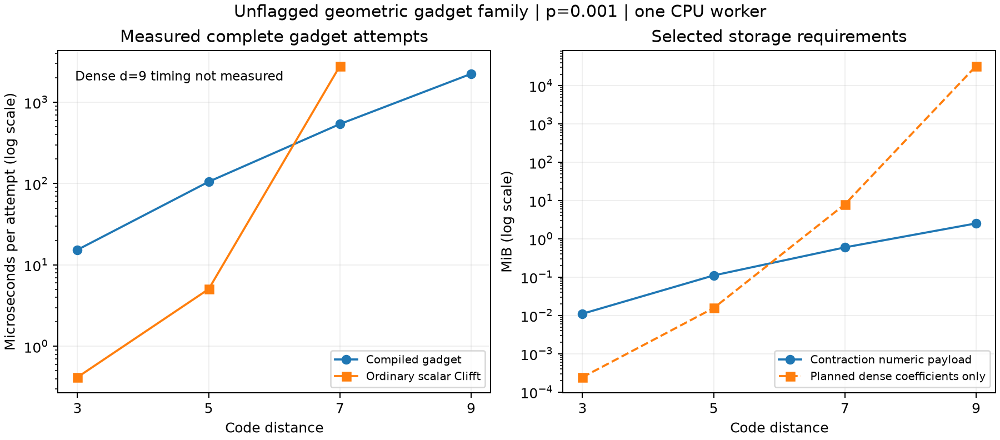

# Geometric Clifford-gadget distance sweep

Performance update: the [PR 471 comparison](scheduled_baseline.md) supersedes
the default-pipeline comparisons below. Explicit unbounded scheduling leaves
the gadget about 4.1x faster at d7, with ordinary Clifft still faster at d3/d5.
The d9 coefficient requirement remains 32 GiB and dense execution is skipped.
The following measurements are retained as the original default-only sweep.

The compiled gadget crosses over from substantially slower at d3/d5 to
**5.2x faster at d7**, and samples a d9 gadget in **2.23 ms per attempt**.
Ordinary Clifft's d9 plan requires 31 active coordinates, or 32 GiB for its
coefficient array alone; that dense execution was deliberately not attempted.
This demonstrates scaling on a reproducible circuit family, not a validated
d9 cultivation protocol or a measured d9 speedup.



## Circuit construction

The [generator](../gadget_family.py) uses the triangular color-code geometry
from the Apache-2.0-licensed
[published construction](https://github.com/Strilanc/magic-state-cultivation/blob/871e68ff6df2f75190b1bfd6351459d1b5a037e3/src/cultiv/_construction/_color_code.py),
at the pinned revision in that link. Data counts are 7, 19, 37, and 61 for
d=3,5,7,9; each has one logical qubit. The small generated check supports
match the pinned Chan author files exactly when expressed in coordinates.
The benchmark adds its own encoder, extraction tree, and noise schedule.

Each complete attempt consists of:

1. Prepare a generic non-stabilizer logical input using H/T/H/T on one wire
   and an ideal Clifford CSS encoder. This exercises both central outcomes.
2. Apply independent data depolarization, followed by the bipartite signed
   transversal T layer and another data depolarization layer.
3. Fold all-data X parity to one data wire along a deterministic breadth-first
   spanning tree of neighboring vertices of the hexagonal geometry. Apply
   two-qubit depolarization after every CNOT. Measure that wire in X with
   readout noise, reset to X+, and apply reset Z noise.
4. Undo the folding circuit, with the same per-CNOT noise model, then apply
   the inverse signed T layer and data depolarization.
5. Measure all-data Y and all X/Z code checks, with independent readout flips.
   Return full records, raw CSS detector bits, and the raw Y observable.

All noise sites use the stated p, including readout and reset noise. There
are 6n sites for n data qubits. There is no idle-noise schedule, injection,
growth, flag verification, or escape/decoding stage. Preparation is ideal,
and final product measurements are evaluation primitives. The raw Y result
is not a logical-failure indicator. Code distance does not establish the
fault distance of this unflagged extraction circuit.

The compiler derives its contractions and fault maps from each generated
physical circuit. It is not given a precomputed fault history or logical
answer. Ordinary Clifft executes the prefix; the native terminal path samples
fresh faults and all measurement outcomes. No runtime tableau analysis or
per-shot Python is introduced. Production Clifft remains unchanged.

## Measured sweep

The [driver](../benchmark_gadget_family.py) runs all four distances at
p=0, 0.001, and 0.01. Below is p=0.001; the other regimes have the same
crossover. [Raw results](gadget_family_data.json) retain all timing batches,
hashes, compilation costs, validation records, and fault choices.

| d | Data qubits | Compiled, us/attempt | Ordinary scalar, us/attempt | Ordinary / compiled |
| --- | ---: | ---: | ---: | ---: |
| 3 | 7 | 15.37 | 0.417 | 0.027x |
| 5 | 19 | 105.50 | 5.055 | 0.048x |
| 7 | 37 | 539.44 | 2792.65 | 5.18x |
| 9 | 61 | 2234.48 | Not executed | Not measured |

CPU: AMD EPYC 9554P, CPU 0, one worker. GCC 13.3, Release, native ISA build.
Each entry is the median of three batches, after 16 warmup attempts. Batch
sizes are 65,536 for d3, 8,192 for d5, and 256 for d7/d9. Larger small-case
batches keep their much faster ordinary baseline measurements out of the
sub-millisecond timing regime. Both paths run in the same native process;
oracle evaluation is performed only after its timing batches finish.

These are complete gadget attempts, including prefix execution, handoff,
fault selection, and record/output generation. There is no postselection or
early rejection. Compilation and process startup are excluded from those
times. At p=0.001, Python bundle preparation takes approximately 8, 35, 137,
and 484 ms; native prefix preparation and loading take 0.32, 0.89, 2.96, and
10.71 ms respectively. This is not a batched/multithreaded performance study.

| d | Ordinary peak active width | Planned dense coefficients | Contraction numeric payload | Maximum marginal scope |
| --- | ---: | ---: | ---: | ---: |
| 3 | 4 | 256 B | 11.35 KiB | 3 |
| 5 | 10 | 16 KiB | 113.70 KiB | 4 |
| 7 | 19 | 8 MiB | 614.16 KiB | 6 |
| 9 | 31 | 32 GiB | 2.54 MiB | 9 |

The storage columns are deliberately limited: dense coefficients exclude
scratch and plan storage; contraction payload includes all marginal scratch,
product buffers, gathers, leaf parities, and output indices, but excludes
container overhead, fault maps, other terminal buffers, and the ordinary
prefix executor. They are calculated array requirements, not measured RSS.
The native CLI inspects the ordinary symbolic plan before allocating its
exponential state and skips execution above the selected width limit (24
for this sweep). This avoids implying that an unexecuted d9 baseline failed
or that d9 is impossible on every machine.

All prefixes remain at active width one. The terminal arithmetic binds four
coherent terms per central outcome. Contraction scope grows from 3 to 9;
the largest factor at d9 has 512 entries. This is not constant-cost scaling
or evidence for a polynomial asymptotic bound. The current native masks also
limit the benchmark to at most 63 data qubits, so d11 requires further work.

## Validation

- Geometry checks verify independent commuting CSS stabilizers and the signed
  transversal Clifford condition for all four sizes. Exhaustive logical-coset
  enumeration confirms code distances 3, 5, and 7; no exhaustive d9 distance
  search was performed. d3/d5 physical check supports match the author corpus.
- For generated d3, an independent dense Qiskit physical-gate/projector
  calculation enumerates all 256 measurement outcomes, including the central
  result. A 2,048-shot native sample passes the simultaneous binomial check
  and samples no impossible outcomes.
- Across the twelve cases, 96 freshly generated fault histories are checked.
  For d3/d5/d7, all 72 complete histories agree with ordinary Clifft forced
  replay of the full physical gates and the prefix. For d9, 24 histories agree
  with the alternate Cirq/Stim coherent-stabilizer overlap reference, whose
  peak term count is four. The latter shares the two-branch gadget identity
  but does not use the contraction implementation, so it is a weaker
  independence claim than full physical replay.
- Stim independently checks every captured record-to-detector/observable map.
  Maximum absolute log-probability disagreement is below 8e-15. Across the
  timed native attempts, the reported normalization error is below 5e-16.
- Seventeen focused tests pass, including the existing noisy handoff and
  dense contraction checks. The new baseline-limit test verifies that
  skipping dense execution leaves the generated native histories unchanged.

## Consequence for the Clifft extension

This strengthens the evidence beyond the single SOFT input: the same compiled
approach handles a geometric family and reaches a case with a much larger
planned dense state. It also rules out enabling it indiscriminately: ordinary
Clifft is about 37x faster at d3 and 21x faster at d5 here. A seamless extension
needs a compiler cost decision and ordinary fallback.

The remaining discriminating step is support for the exact author logical
readout and flagged gadgets identified in the [coverage audit](terminal_coverage.md).
Those may change coherent-term counts and contraction costs. This sweep has
not fixed those coverage gaps or demonstrated a larger fault-tolerant protocol.
It measures ordinary-noise cost; estimating rare accepted logical failures
still requires a validated protocol and weighted sampling. Fixed-k support
across the native prefix/suffix boundary remains unimplemented.

## Reproduction

```bash
cmake --build build-study --target sample_terminal_gadget replay_cultivation -j4
UV_CACHE_DIR=/tmp/clifft-study-uv-cache \
MPLCONFIGDIR=/tmp/clifft-gadget-mpl \
OMP_NUM_THREADS=1 OPENBLAS_NUM_THREADS=1 PYTHONPATH=tools/profile \
uv run --offline --frozen --group dev --with cirq-core==1.6.1 \
  python tools/profile/benchmark_gadget_family.py \
  --output tools/profile/research/gadget_family_data.json

UV_CACHE_DIR=/tmp/clifft-study-uv-cache MPLCONFIGDIR=/tmp/clifft-gadget-mpl \
uv run --offline --frozen --group dev --with cirq-core==1.6.1 \
  python tools/profile/plot_gadget_family.py \
  tools/profile/research/gadget_family_data.json \
  tools/profile/research/gadget_family.png
```

The offline commands assume cached dependencies. Generated source is fully
reproducible via `gadget_family.make_circuit(distance, probability)`; the raw
report includes each circuit's SHA-256 and the generator's SHA-256.
